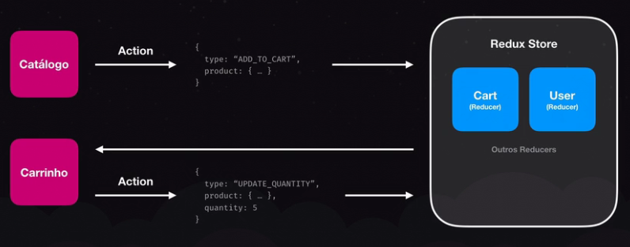
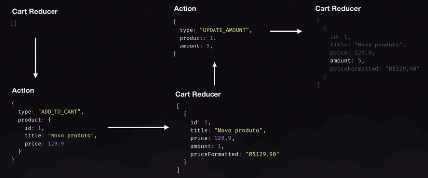

# Redux

- Lib q implementa arquitetura Flux. Serve p/ React, RN, Flutter, Angular, até
  msm JS puro.
- Controle de estados globais.
- Qnd usar:
  - Meu estado tem mais de um "dono"
  - Meu estado é manipulado por mais componentes
  - As ações do usuário causam efeitos colaterais nos dados
- Exemplos: Dados do usuário, Carrinho de compras, etc.

> Para ir para as anotações do Redux no projeto:
> Caderno_de_Anotacoes/3-Configurando_o_carrinho/1-Configurando_Redux

## Arquitetura Flux

## Princípios

- Toda action deve possuir um "type" único;
- O estado do Redux é o único ponto de verdade. Tudo relacionado a cada reducer
  tem q ficar dentro do Redux.
- Não podemos mutar o estado do Redux sem uma action.
- As actions e reducers são funções puras, ou seja, não lidam com side-effects
  assíncronos. As actions e reducers não são assíncronos. Isto quer dizer q elas
  nunca vão fazer uma chamada API, acessar um banco de dados, nada assíncrono.
  Porém, existem o Redux Saga, para side-effects assíncronos.
- Qualquer lógica síncrona para regras de negócio deve ficar no reducer e nunca
  na action
- Nem toda aplicação precisa do Redux. Inicie sem ele, e sinta a necessidade
  depois.

### Exemplo - carrinho de compras

