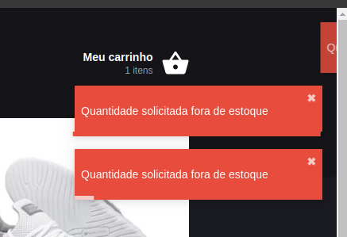

# React Toastify

Essa lib é foda! Cria pop-ups de forma mt prática e estilizado, e totalmente
personalizável.

No projeto, será uma msg de erro qnd o usuário adicionar um produto fora de
estoque.



`yarn add react-toastify`

## src/App.js

```diff
import React from 'react';
import { BrowserRouter } from 'react-router-dom';
import { Provider } from 'react-redux';
+ import { ToastContainer } from 'react-toastify';

import './config/ReactotronConfig';

import GlobalStyle from './styles/global';
import Header from './components/Header';
import Routes from './routes';

import store from './store';

function App() {
  return (
    <Provider store={store}>
      {/* O BrowserRouter fica geralmente no routes.js. Nesse projeto ele está
      aqui * pq o Header vai possuir navegação e, por isso, vai precisar acessar
      as * propriedades de navegação do router-dom. */}
      <BrowserRouter>
        <Header />
        <Routes />
        <GlobalStyle />
+       <ToastContainer autoClose={3000} />
      </BrowserRouter>
    </Provider>
  );
}

export default App;
```

## src/styles/global.js

```diff
import { createGlobalStyle } from 'styled-components';

+ import 'react-toastify/dist/ReactToastify.css';
import background from '../assets/images/background.svg';

export default createGlobalStyle`
  /* Olha como é fácil pegar uma fonte na API do google! */
  @import url('https://fonts.googleapis.com/css?family=Roboto&display=swap');

  * {
    margin: 0;
    padding: 0;
    outline: 0;
    box-sizing: border-box;
  }

  body {
    background: #191920 url(${background}) no-repeat center top;
    -webkit-font-smoothing: antialiased;
  }

  body, input, button {
    font: 14px Roboto, sans-serif;
  }

  #root {
    max-width: 1020px;
    margin: 0 auto;
    padding: 0 20px 50px;
  }

  button {
    cursor: pointer;
  }

`;
```

## src/store/modules/cart/sagas.js

```diff
import { call, select, put, all, takeLatest } from 'redux-saga/effects';
+ import { toast } from 'react-toastify';

import api from '../../../services/api';
import { formatPriceBRL } from '../../../util/format';

import { addToCartSuccess, updateAmount } from './actions';

// function* addToCart(action) {
function* addToCart({ id }) {
  try {
    const productExists = yield select((state) =>
      state.cart.find((p) => p.id === id)
    );

    const stock = yield call(api.get, `/stock/${id}`);

    const stockAmount = stock.data.amount;
    const currentAmount = productExists ? productExists.amount : 0;

    const amount = currentAmount + 1;

    if (amount > stockAmount) {
-     console.tron.warn('Error: no product in stock');
+     toast.error('Quantidade solicitada fora de estoque');
      return; // Exit na função
    }

    if (productExists) {
      yield put(updateAmount(id, amount));
    } else {
      // const response = yield call(api.get, `/products/${action.id}`);
      const response = yield call(api.get, `/products/${id}`);

      const data = {
        ...response.data,
        amount: 1,
        priceBRL: formatPriceBRL(response.data.price),
      };

      yield put(addToCartSuccess(data));
    }
  } catch (err) {
    console.tron.log(err);
  }
}

export default all([takeLatest('@cart/ADD_REQUEST', addToCart)]);
```
